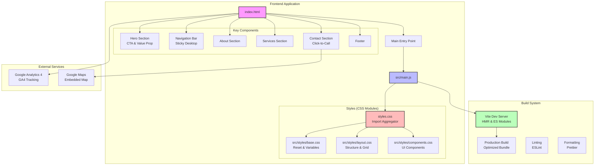

# Tecsoil - Site Assessments

A professional website for Tecsoil, a site assessment company specializing in on-site wastewater treatment systems in West Donegal, Ireland.

## About Tecsoil

Tecsoil has been carrying out site assessments since 2001 and is on the select list of approved site assessors for on-site wastewater treatment. We provide professional site suitability assessments in accordance with EPA Code of Practice 2009.

## Features

- **Responsive Design**: Mobile-friendly layout that works on all devices
- **Modern Development Stack**: Built with Vite for fast development and optimized builds
- **Professional Content**: Accurate information about services, qualifications, and process
- **Contact Information**: Easy access to phone numbers and location details
- **Service Details**: Comprehensive explanation of assessment process and requirements

## Architecture



### Tech Stack

- **Frontend Framework**: Vanilla JavaScript with ES6 modules
- **Build Tool**: Vite 6.3.5 for fast development and optimized production builds
- **Styling**: Modular CSS with custom properties for theming
- **Analytics**: Google Analytics 4 (GA4) integration
- **Development Tools**: ESLint for code quality, Prettier for formatting

### Project Structure

```
tecsoil-site/
├── index.html              # Main HTML file
├── styles.css              # CSS import aggregator
├── src/
│   ├── main.js            # JavaScript entry point
│   ├── styles/
│   │   ├── base.css       # CSS reset, variables, typography
│   │   ├── layout.css     # Page structure, grid, responsive
│   │   └── components.css # Component-specific styles
│   ├── assets/            # Images, fonts (future)
│   └── components/        # Reusable components (future)
├── package.json           # Project dependencies
├── vite.config.js         # Vite configuration
└── docs/                  # Documentation files
```

## Development

### Prerequisites

- Node.js (v14 or higher)
- npm or yarn

### Installation

```bash
git clone https://github.com/garyboyle/tecsoil.git
cd tecsoil
npm install
```

### Development Commands

```bash
# Start development server with hot reload
npm run dev

# Build for production
npm run build

# Preview production build
npm run preview

# Run linter
npm run lint

# Format code
npm run format
```

### Project Structure

```
src/
├── components/     # Reusable components (future expansion)
├── styles/         # CSS modules
│   ├── base.css    # Reset, variables, typography
│   ├── layout.css  # Grid, flexbox, responsive design
│   └── components.css # Component-specific styles
├── assets/         # Images, fonts, etc.
└── main.js         # Application entry point

docs/               # Company documentation
public/             # Static assets
```

### CSS Architecture

The project uses a modular CSS approach with:

- **CSS Custom Properties**: Consistent theming with variables like `--primary-blue` and `--primary-green`
- **Organized Stylesheets**: Separated into base, layout, and component styles
- **Responsive Design**: Mobile-first approach with breakpoints
- **Semantic HTML**: Proper structure for accessibility and SEO

### Technology Stack

- **Vite**: Fast build tool with hot module replacement
- **Vanilla JavaScript**: ES6+ modules for enhanced functionality
- **Modern CSS**: Custom properties, Grid, Flexbox
- **ESLint**: Code linting for quality assurance
- **Prettier**: Code formatting for consistency

## Services

Tecsoil provides:

- Site suitability assessments for on-site wastewater treatment
- Complimentary initial site consultations
- Detailed site layout plans (1:500 scale)
- EPA Code of Practice 2009 compliant assessments
- Independent wastewater system recommendations
- Construction supervision and compliance certification

### Qualifications

- FAS/EPA Site Suitability Assessment (FETAC)
- Certificate in Construction Studies and Civil Engineering
- Building Energy Assessor (BER) FETAC
- AMIEI - Associate Member of Engineers Ireland
- IOWA - Irish Onsite Wastewater Association

## Contact Information

**Office**: 074 9561850  
**Mobile**: 087 2868411  
**Address**: Pole Rd., Meenmore, Dungloe, Co. Donegal

## Professional Standards

- Full Professional Indemnity Insurance
- Independent of wastewater treatment manufacturers
- Approved by Donegal County Council
- EPA Code of Practice 2009 compliant

## Deployment

The site is optimized for deployment on modern hosting platforms:

```bash
# Build for production
npm run build

# Deploy the dist/ folder to your hosting platform
```

Compatible with:
- Netlify
- Vercel
- GitHub Pages
- Traditional web hosting

## License

© 2024 Tecsoil. All rights reserved.

## Contributing

This is a professional business website. For updates or changes, please contact Tecsoil directly.

---

*Professional site assessments for West Donegal since 2001*